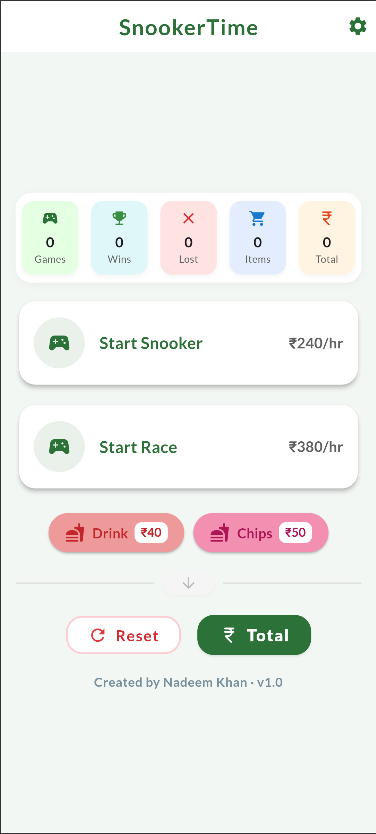
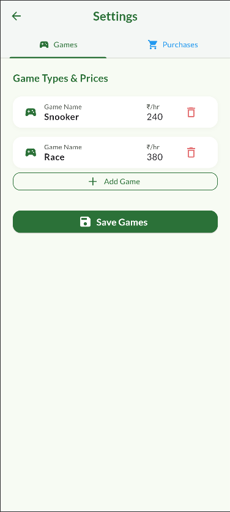
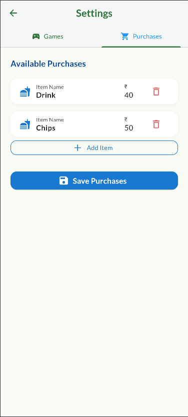
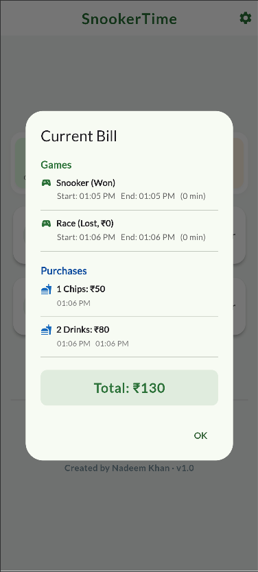

# 🎱 SnookerTime

A simple, professional Flutter app to track your snooker club sessions, auto-calculate your bill, and log every purchase — **no accounts, no ads, just tap and go**.

---

## 📥 Download

You can download the latest release APK here:  
[https://nadeemkhan.in/snookertime.apk](https://nadeemkhan.in/snookertime.apk)

---

## ✨ Features

- Start/Stop Game Sessions — Time your play, track wins/losses, and calculate the bill by the minute.
- Quick Purchases — Add drinks, chips, or any item instantly with one tap.
- Live Dashboard — See a real-time, icon-based summary of today’s play, wins, losses, items, and spending.
- Beautiful Bill View — Instantly see your total, breakdown, and each purchase with timestamps.
- Easy Reset — Clear all for the next visit.
- Full Customization — Edit/add/remove any game or item with your own price.
- Light & Dark Mode — Toggle anytime.
- All data stored locally — No account or internet required.

---

## 📸 Screenshots

<p align="center">
  
  
</p>

<p align="center">
  
  
</p>

---

## 🚀 Getting Started

1. **Clone this repository:**

    ```bash
    git clone https://github.com/nadeemkhan/SnookerTime.git
    cd SnookerTime
    ```

2. **Install Flutter:**

    If you haven’t already, [install Flutter](https://docs.flutter.dev/get-started/install) for your operating system.

    To verify your Flutter install, run:

    ```bash
    flutter doctor
    ```

3. **Run the app:**

    ```bash
    flutter pub get
    flutter run
    ```
    Choose your device or emulator when prompted.

4. **Build APK (Android):**

    ```bash
    flutter build apk --release
    ```
    The APK will be in `build/app/outputs/flutter-apk/`.

---

## 🛠️ Customizing

- **Edit Games:**  
    Tap the ⚙️ **Settings** button (top-right).  
    In the *Games* tab, add, edit, or delete any game.  
    Each game can have its own price per hour.

- **Edit Purchases:**  
    Switch to the *Purchases* tab in Settings.  
    Add, edit, or remove items (drinks, chips, snacks, etc) and set their price.

- **All your data stays on your device. No sign-in, no internet needed.**

---

## 🤝 Contributing

Found a bug? Want a feature? Open an [issue](https://github.com/nadeemkhan/SnookerTime/issues).  
PRs are welcome! Please keep code clean, tested, and readable.

---

## 📝 License

This project is MIT licensed.  
See [LICENSE](LICENSE) for details.

---

## 👤 Author

Built by [Nadeem Khan](https://nadeemkhan.in)
